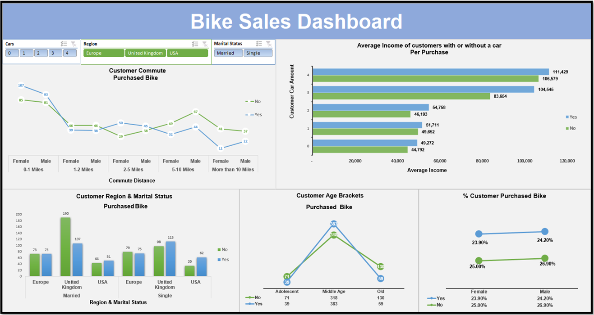

# Bike-Sales-Dashboard

## Bike Sales Dashboard 

### Interactive dashboard where you can filter number of cars that a customer own/s e.g. 0, 1, 2, 3, 4. You can filter by region to view Europe, United Kingdom and USA customers. Also you can filter by Marital Status, with options of married or single. 

### In this report I will analyse the data of the bike store owner's customers, the owner needs this data to help maintain and discover ways to increase sales. 

I will compare: 

<li>Customers that purchase bikes with those who decided not to purchase a bike throughout this report.
<li>I analysed customer commutes. 
<li>Average Income of Customers with or without a car. 
<li>Customer Age Brackets. 
<li>Customer Region & Marital Status
<li>% Customer Purchased Bike 

Software Used: Microsoft Excel

Charts Used: 
Line Chart x3, Bar Chart and Column Chart.

