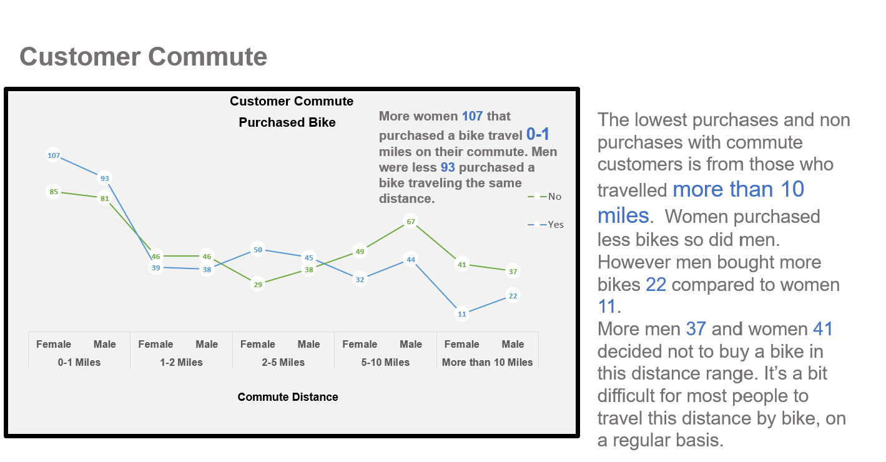
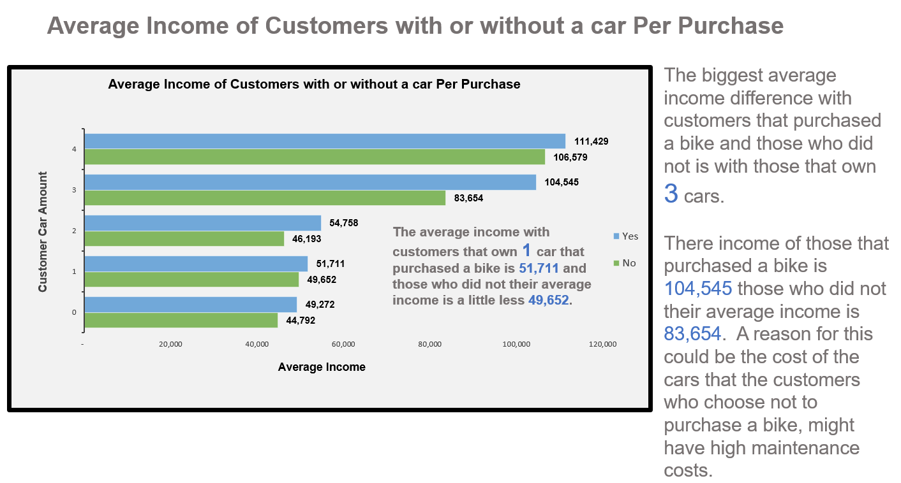
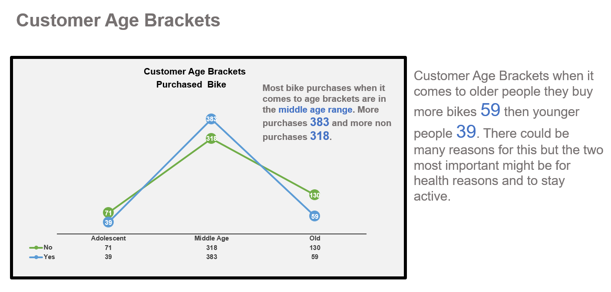
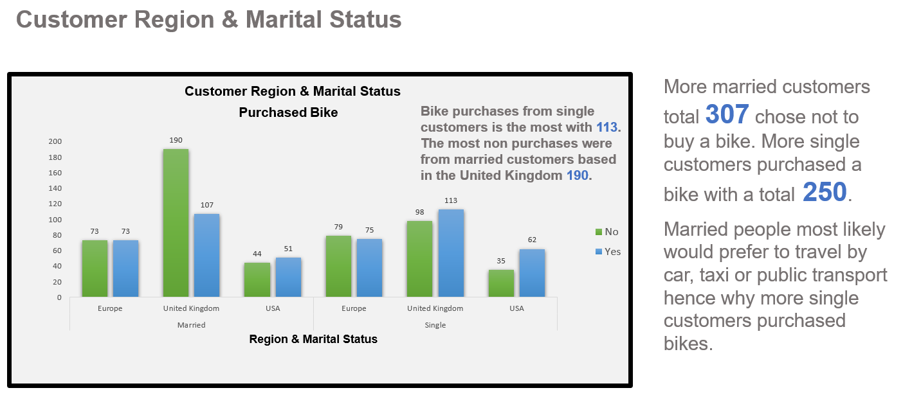
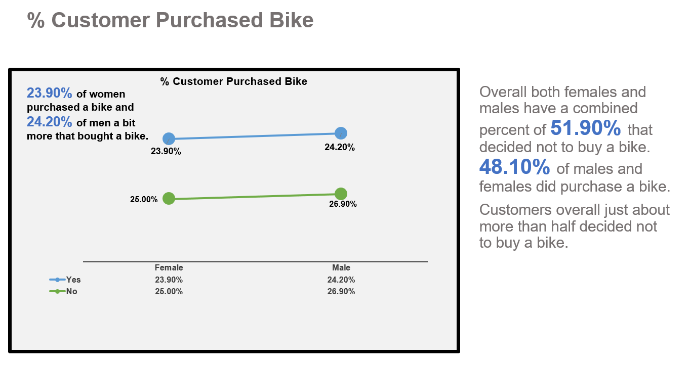
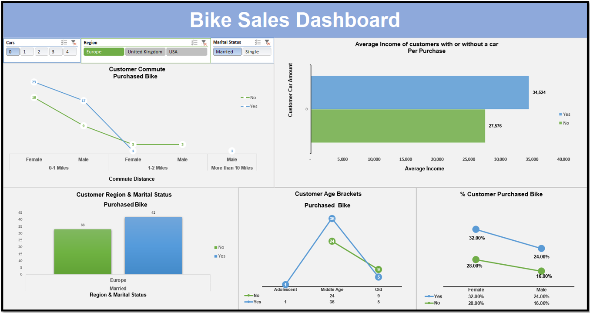

# Bike-Sales-Dashboard

## Bike Sales Dashboard 

### Interactive dashboard where you can filter number of cars that a customer own/s e.g. 0, 1, 2, 3, 4. You can filter by region to view Europe, United Kingdom and USA customers. Also you can filter by Marital Status, with options of married or single. 

### In this report I will analyse the data of a Bike business customers, wanting to view the information of their customers purchasing their bikes. The owner needs this data to help maintain and discover ways to increase sales. 

### I will compare: 

<li>Customers that purchase bikes with those who decided not to purchase a bike throughout this report.
<li>I analysed customer commutes. 
<li>Average Income of Customers with or without a car. 
<li>Customer Age Brackets. 
<li>Customer Region & Marital Status
<li>% Customer Purchased Bike 

Software Used: Microsoft Excel

Charts Used: 
Line Chart x3, Bar Chart and Column Chart.

   

   

## Dashboard filter settings with Cars 0 filter, Region Europe filter and Marital Status Married filter

### Customers from Europe with 0 cars and married travel mostly from 0-2 miles on their commutes. Average income 34,524 who purchased a bike. Europe and married customers purchased 42 bikes. Middle age range was the highest with 36 purchases. Overall most customer purchases under these filter settings, with male and female was a combination of 56%. So this group of customers is more likely to purchase a bike. 

## Summary

### In this report I analysed: 

<li>Customers that purchase bikes with those who decided not to purchase a bike throughout this report.
<li>I analysed customer commutes. 
<li>Average Income of Customers with or without a car.
<li>Customer Age Brackets.
<li>Customer Region & Marital Status.
<li>Percentage of Customer Purchased Bike.

### 51.90% customers that decided not to buy a bike. However customers from Europe with 0 cars and married, these customers together male and female have a combine 56% of total customer purchases. Now customers with 1 car or 0 have a combined 58.95% total customer purchases. Customers with a 1 or 0 cars tend to buy bikes from this business. A way in which this business can improve bike sales is to focus more advertisement to people with 1 car or 0, these are the customers most likely going to purchase a bike or two. Customers with no car we can especially reach out to them and give them reasons why they need this affordable mode of transport.  

